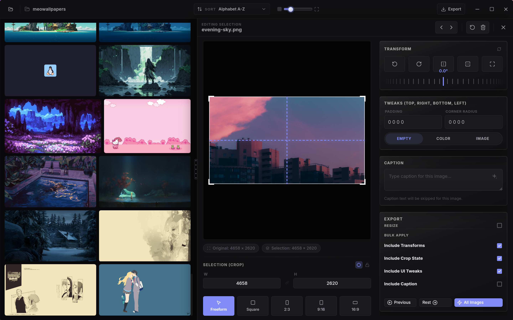

# Beautiful Batches

A cross-platform desktop app for batch photo editing and captioning. Edit once, apply everywhere. Crop, Rotate, Pad, Resize, Caption, and Export, all in one place.



## Quick links

- [Install and run](#install-and-run)
- [Automated releases](#automated-releases)
- [Features](#features)
- [Contributing](#contributing)

## What the app does

1. Browse image folders in a masonry-style gallery.
2. Edit one image, apply to all.
3. Plan the export before writing files.
4. Export to a folder or zip.

## Features

### Gallery and curation

- Justified masonry gallery designed for large image sets.
- Folder explorer with nested selection support.
- Sort by last modified, name, size, or shuffle.
- Exclude images without deleting them from disk.
- Excluded images stay visible in the gallery with restore action.

### Editing

- Crop with presets and freeform.
- Rotate and flip.
- Output resize.
- Inner padding with color, gradient, or image fill.
- Per-corner radius.
- Caption editing with optional sidecar output.
- Bulk apply from the current image to other images in scope.

### Draft behavior

- Edits are saved as folder drafts and restored on next session.
- Drafts include crop/transform settings, captions, and excluded state.
- Edited folders are indicated in explorer and can be reset.

### Export planning

- Scope:
  - Current image
  - Current folder
  - Selected folders
- Destination:
  - Folder
  - Zip
- Structure mode:
  - Preserve
  - One level
  - Flatten
- Name patterns with tokens: `{name}` `{index}` `{date}` `{folder}`
- Conflict modes: Auto-rename, Skip, Overwrite
- Optional metadata clearing

## Supported formats

Input scan:

- `jpg`, `jpeg`, `png`, `webp`, `avif`

Output:

- `png`, `jpeg`, `webp`
- Original passthrough is used when no re-encode is required

## Install and run

### Prerequisites

- Node.js 18+
- npm
- Rust toolchain
- Tauri v2 prerequisites: https://tauri.app/start/prerequisites/

### Commands

| Goal | Command |
| --- | --- |
| Install dependencies | `npm install` |
| Run desktop app | `npm run tauri:dev` |
| Run frontend-only mode | `npm run dev` |
| Lint | `npm run lint` |
| Build desktop app | `npm run tauri:build` |

Note: native scanning and export execution require the Tauri runtime.

### One-line installer (latest release)

macOS / Linux:

```bash
curl -fsSL https://raw.githubusercontent.com/supSugam/beautiful-batches/main/scripts/install.sh | bash
```

Windows (PowerShell):

```powershell
irm https://raw.githubusercontent.com/supSugam/beautiful-batches/main/scripts/install.ps1 | iex
```

## Automated releases

Releases are fully automated through GitHub Actions:

1. Push conventional commits to `main` (`feat:`, `fix:`, `perf:`, etc.).
2. `.github/workflows/release.yml` runs `release-please`.
3. `release-please` opens/updates a release PR that bumps versions in:
   - `package.json`
   - `src-tauri/Cargo.toml`
   - `src-tauri/tauri.conf.json`
4. When the release PR is merged, a GitHub Release is created and Tauri bundles are built/uploaded for:
   - Linux
   - Windows
   - macOS

Versioning config lives in:

- `release-please-config.json`
- `.release-please-manifest.json`

## Keyboard shortcuts

- `Ctrl/Cmd + B`: Toggle explorer
- `F11`: Toggle fullscreen (desktop runtime)
- `Arrow Left / Arrow Right`: Previous or next image in inspector

## Project structure

```text
src/
  components/        UI: explorer, grid, inspector, export modal
  store/             Zustand state and image metadata flow
  utils/             Draft persistence and native bridge

src-tauri/src/
  commands.rs        Tauri command entry points
  scanner.rs         Directory scan and folder traversal
  image_processing.rs Export execution pipeline
  storage.rs         Root path persistence
```

## Contributing

- Read [CONTRIBUTING.md](./CONTRIBUTING.md)
- Open issues with templates in [.github/ISSUE_TEMPLATE](./.github/ISSUE_TEMPLATE)
- Use the PR checklist in [.github/pull_request_template.md](./.github/pull_request_template.md)